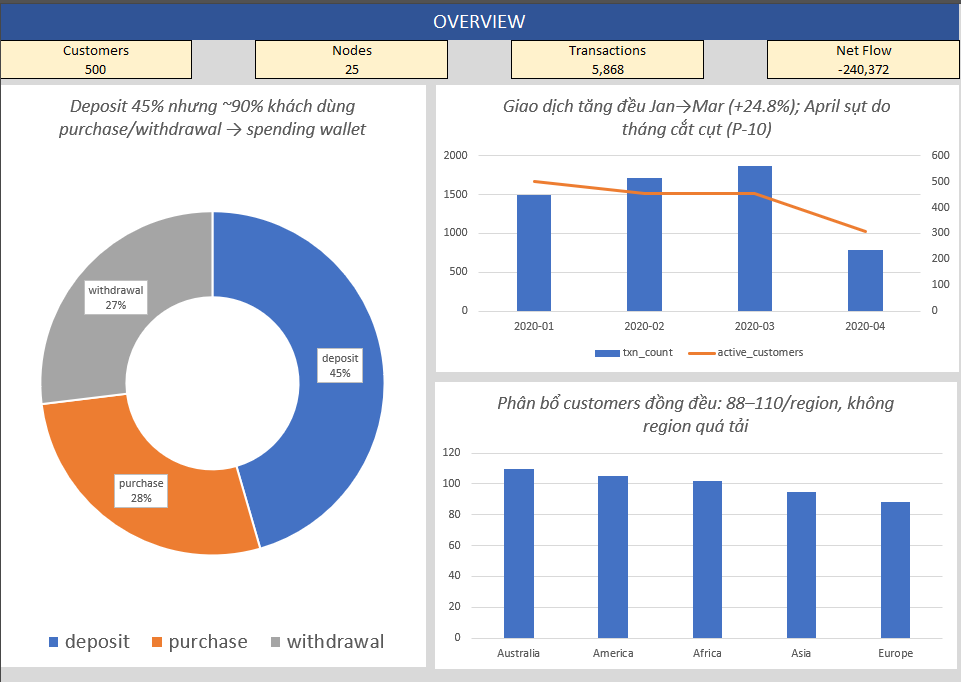
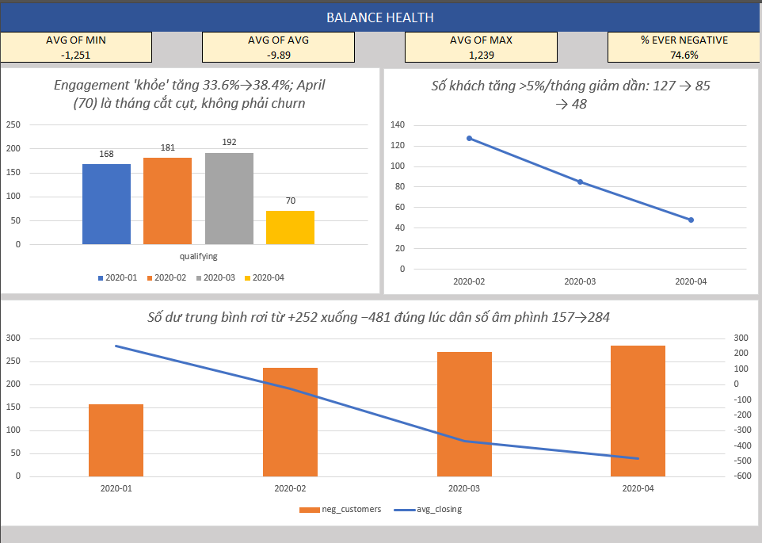
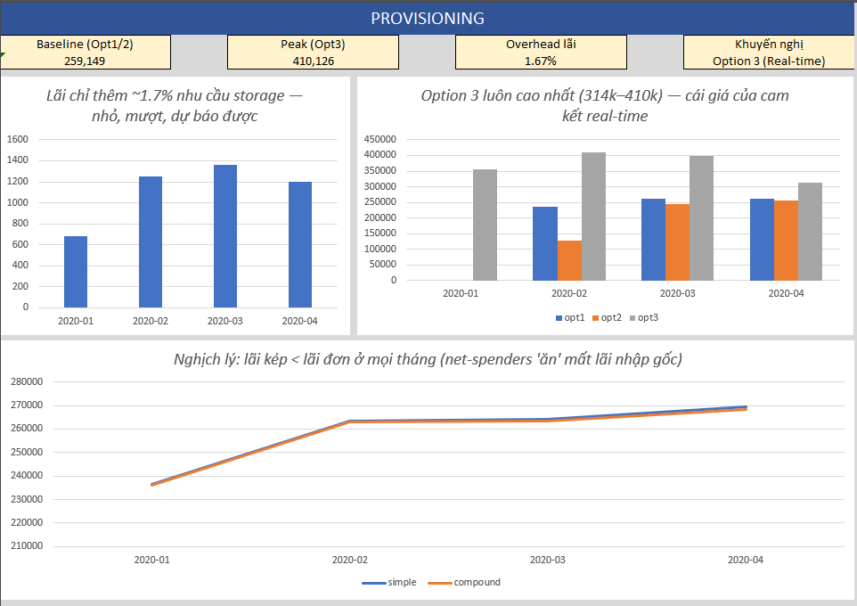

# 🏦 Data Bank — Portfolio Phân Tích Dữ Liệu SQL

**Tác giả:** Nguyễn Thị Bảo Trân | **Cập nhật lần cuối:** Tháng 8/2026


## 📌 Dự án này là gì?
Đây là một dự án portfolio phân tích hành vi khách hàng, hạ tầng node (máy chủ bảo mật), và chiến lược cấp phát dung lượng lưu trữ dữ liệu cho **Data Bank** — một ngân hàng số giả định. 

Dựa trên **[8 Week SQL Challenge — Case Study #4 (Data Bank)](https://8weeksqlchallenge.com/case-study-4/)**, dự án này vượt ra khỏi khuôn khổ một bài tập SQL thông thường bằng cách tiếp cận nó như một bài toán phân tích nghiệp vụ thực tế, đi kèm với các bước đánh giá chất lượng dữ liệu, các insight mang tính hành động (actionable insights), và quá trình kiểm chứng logic chặt chẽ.

## 🎯 Bài Toán Nghiệp Vụ (Business Problem)
Data Bank vận hành theo một mô hình kinh doanh độc đáo: **dung lượng lưu trữ đám mây cấp phát cho khách hàng gắn liền trực tiếp với số dư tài khoản của họ**. 

Câu hỏi nghiệp vụ cốt lõi: **Ngân hàng cần dự trù (provision) bao nhiêu dung lượng lưu trữ dữ liệu cho khách hàng mỗi tháng?**

Để trả lời câu hỏi này, ngân hàng cần hiểu rõ:
- Hạ tầng node của họ hiện đang được phân bổ như thế nào.
- Khách hàng đang sử dụng tài khoản ra sao (nạp tiền, rút tiền, mua sắm).
- Các mô hình cấp phát dữ liệu khác nhau sẽ tác động thế nào đến nhu cầu dự trù dung lượng của ngân hàng.

## 🗄️ Tập Dữ Liệu (Dataset)
- **`regions`**: 5 dòng (Các châu lục nơi Data Bank hoạt động)
- **`customer_nodes`**: 3,500 dòng (Lịch sử phân bổ khách hàng vào các node bảo mật)
- **`customer_transactions`**: 5,868 dòng (Lịch sử giao dịch nạp, rút và mua sắm của khách hàng)
- **Phạm vi**: 500 khách hàng duy nhất trải dài trên 5 khu vực (regions).
- **Khung thời gian**: Tháng 1 – Tháng 4 năm 2020.

## 🛠️ Những Gì Tôi Đã Làm (Quy Trình Phân Tích)
1. **[Đánh Giá & Kiểm Định Chất Lượng Dữ Liệu](docs/data_profiling_report.md)**: Kiểm tra hệ thống các giá trị null, bản ghi trùng lặp, phạm vi thời gian không hợp lệ và sự chồng chéo thời gian (temporal overlaps) nhằm đảm bảo tính toàn vẹn của dữ liệu trước khi phân tích.
2. **[Phân Tích Node Khách Hàng](docs/solutions_a_customer_nodes.md)**: Phân tích sự phân bổ hạ tầng và mô hình tái phân bổ (reallocation) node để thấu hiểu các yêu cầu về năng lực hệ thống (capacity).
3. **[Phân Tích Giao Dịch Khách Hàng](docs/solutions_b_customer_transactions.md)**: Đánh giá mức độ tương tác tài khoản, sức khỏe số dư và sự leo thang của rủi ro thấu chi (overdraft risks).
4. **[Mô Hình Hóa Cấp Phát Dữ Liệu](docs/solutions_c_data_allocation.md)**: So sánh 3 chiến lược cấp phát dữ liệu khác nhau (số dư lũy kế vs. trung bình tháng vs. thời gian thực) nhằm tối ưu hóa chi phí lưu trữ cho ngân hàng.
5. **[Tăng Trưởng Dữ Liệu Dựa Trên Lãi Suất](docs/solutions_d_interest.md)**: Mô phỏng tác động của việc áp dụng lãi đơn và lãi kép tính theo ngày lên dung lượng dữ liệu cần cấp phát cho khách hàng.

## 💡 Các Phát Hiện Chính (Key Findings)
- **Hành Vi "Ví Chi Tiêu" (Spending Wallet)**: Data Bank chủ yếu được sử dụng như một tài khoản chi tiêu. Trong suốt 4 tháng, hệ thống ghi nhận dòng tiền ròng (net cash flow) là **–$240,372**. Tính đến tháng 4, **56.8%** khách hàng nắm giữ số dư âm.
- **Mở Rộng Hạ Tầng (Infrastructure Scaling)**: Các node được phân bổ hoàn toàn đồng đều (chính xác 5 node mỗi region), cho thấy đây là thiết kế mở rộng theo chiều ngang (horizontal scaling) có chủ đích cho việc hoạch định năng lực, thay vì một cấu trúc phát triển tự nhiên theo nhu cầu.
- **Quy Tắc "Sàn 0" (Zero-Floor Rule) Là Bắt Buộc**: Vì có quá nhiều khách hàng mang số dư âm, bất kỳ mô hình cấp phát nào cũng phải áp dụng sàn 0 cho các số dư âm nhằm ngăn chặn việc ngân hàng dự trù "dung lượng lưu trữ âm" (điều vô lý về mặt vật lý).
- **Khuyến Nghị Chọn Option 3 (Cấp Phát Thời Gian Thực)**: Phương án này phù hợp nhất với lời hứa thương hiệu "dữ liệu thời gian thực" của Data Bank và giảm thiểu rủi ro dự trù dung lượng cho những khách hàng đã rút cạn tài khoản (một lỗ hổng của mô hình trung bình có độ trễ).
- **Nghịch Lý Lãi Kép (The Compounding Paradox)**: Một cách nghịch lý, việc áp dụng *lãi kép tính theo ngày* lại dẫn đến tổng dung lượng dữ liệu cần cấp phát thấp hơn lãi đơn trong tập dữ liệu cụ thể này. Tại sao? Vì đa số khách hàng là những người chi tiêu ròng (net-spenders); lãi kép áp dụng mức lãi suất 0% lên các số dư âm, làm đình trệ sự tăng trưởng dung lượng ở những khách hàng đã thấu chi.

## 💻 Công Cụ & Kỹ Thuật SQL
- **Cơ sở dữ liệu**: PostgreSQL
- **Các kỹ thuật đã sử dụng**:
  - CTE phức tạp (Common Table Expressions)
  - Hàm cửa sổ - Window Functions (`SUM() OVER()`, `LAG()`, `ROW_NUMBER()`)
  - Phân vị - Percentiles (`PERCENTILE_CONT`)
  - CTE đệ quy - Recursive CTEs (dùng để mô phỏng lãi kép theo ngày)
  - Số học Ngày & Giờ (`generate_series`, `INTERVAL`)
  - Tổng hợp đa tầng (Multi-level Aggregation) & Truy vấn con tương quan (Correlated Subqueries)

## 📂 Cấu Trúc Dự Án
```text
data-bank-portfolio/
├── data/
│   └── raw/                 # Dữ liệu nguồn (DataBase.sql)
├── sql/                     
│   ├── 01_data_profiling.sql                     # Kiểm định chất lượng dữ liệu hệ thống
│   ├── 02_data_quality_confirmation.sql          # Tạo View & gắn cờ (flagging)
│   ├── 03_analysis_a_customer_nodes.sql          # Phân tích hạ tầng
│   ├── 04_analysis_b_customer_transactions.sql   # Phân tích hành vi giao dịch
│   ├── 05_analysis_c_data_allocation.sql         # Mô hình hóa 3 tùy chọn lưu trữ
│   └── 06_analysis_d_interest.sql                # Mô hình Lãi đơn vs Lãi kép
├── docs/                     
│   ├── data_profiling_report.md
│   ├── solutions_a_customer_nodes.md
│   ├── solutions_b_customer_transactions.md
│   ├── solutions_c_data_allocation.md
│   └── solutions_d_interest.md
└── outputs/
    ├── charts/              # Trực quan hóa (Biểu đồ phân phối, Xu hướng)
    └── tables/              
        ├── analysis/        # Kết quả phân tích chính (19 file CSV)
        └── profiling/       # Kết quả kiểm định chất lượng dữ liệu (14 file CSV)
```

## 📊 Dashboard

Dashboard 3 trang được dựng trong Excel, tái hiện trực quan chuỗi phát hiện từ Section A → B → C → D. Mỗi trang kể một câu chuyện riêng, số liệu lấy nguyên từ các CSV trong `outputs/tables/analysis/`.

**File nguồn:** [`dashboard/data_bank_dashboard.xlsx`](dashboard/data_bank_dashboard.xlsx)

### Trang 1 — Quy mô & Hạ tầng

- **500 customers** trải đều trên **25 nodes** (5 region × 5 nodes/region), không region nào quá tải (88–110 customers).
- Giao dịch tăng đều Jan→Mar (+24.8%); April sụt là do **tháng cắt cụt (P-10)**, không phải churn.
- **Deposit chiếm 45.5%** tổng giao dịch nhưng ~90% customers có purchase/withdrawal → Data Bank vận hành như **spending wallet**, không phải savings account.

### Trang 2 — Sức khỏe số dư & Rủi ro thấu chi

- **"Cái kéo" overdraft:** avg closing balance rơi từ **+$252 → −$481** đúng lúc dân số âm tiền phình **157 → 284** (31.4% → 56.8%).
- **74.6% customers từng âm tiền** ít nhất 1 lần; chỉ **37%** từng nuôi lớn tài khoản >5%/tháng → hành vi "vào nhanh, ra nhanh" chi phối toàn bộ tệp.
- Engagement "khỏe" (nhiều deposit + chi tiêu trong cùng tháng) tăng đều 33.6% → 38.4% (April thấp là tháng cắt cụt).

### Trang 3 — Quyết định Provisioning

- **Option 3 (Real-time)** luôn đắt nhất (314k–410k units) — cái giá của cam kết real-time; **Option 1/2** rẻ hơn (~260k) nhưng mang "độ trễ" trải nghiệm và **gãy hoàn toàn** khi dân số âm tiền phình to (raw rơi xuống −184k ở April).
- **Compounding paradox:** lãi kép cho **ít data hơn** lãi đơn — net-spenders "ăn" mất phần lãi nhập gốc mỗi khi rút tiền, khoảng cách widening dần (91 → 884 units/tháng).
- **Khuyến nghị:** Zero-Floor bắt buộc + chọn **Option 3** để khớp cam kết thương hiệu "real-time data platform" của Data Bank.



