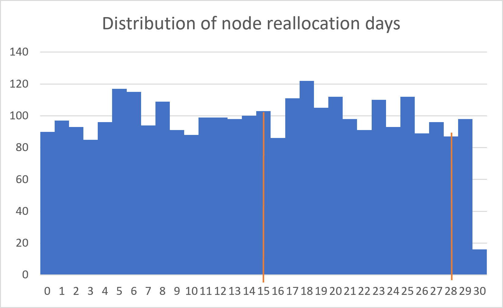

# Section A — Customer Nodes Exploration

**Author:** Nguyen Thi Bao Tran
**Last revised:** 2026-08-26
**Source SQL:** `sql/03_analysis_a_customer_nodes.sql`

## Overview
Phần này khám phá cấu trúc hạ tầng node của Data Bank và cách customers được phân bổ theo thời gian. Kết quả là nền tảng cho các phần sau như transaction analysis và data allocation.

**Quy tắc áp dụng từ Data Profiling Report:**
- [R1] Current node = `end_date = '9999-12-31'` (profiling §5.3)
- [R2] Unique node = `(region_id, node_id)` (profiling §11.2)
- [R3] Khi tính duration, loại sentinel rows (`end_date = '9999-12-31'`) vì đây là allocation **đang mở**, không phải ngày kết thúc thật.

## Executive Summary (TL;DR cho business reader)
- **Hạ tầng phân tán cân bằng:** 25 unique nodes (5 nodes × 5 regions) — cơ sở dữ liệu cho thông điệp "distributed security".
- **Phân bổ customers đồng đều:** 88–110 customers/region trên tổng 500 — không region quá tải hay bị bỏ đói.
- **Cơ chế reallocation ổn định và đồng nhất:** trung bình 14.6 ngày/lần; 95% lượt reallocation hoàn tất trong ≤ 28 ngày ở **mọi** region.
- **Caveat nền:** dataset có dấu hiệu synthetic → kết quả dùng cho case study, không dùng như bằng chứng vận hành thực tế.

---

## A.1. Quy mô hạ tầng: 25 unique nodes phân tán
*(How many unique nodes are there on the Data Bank system?)*

### 🎯 Business Context
Xác định quy mô hạ tầng node — yếu tố then chốt cho messaging "world-leading security" với investors và cho hoạch định capacity sau này.

### 🧠 Approach
`node_id` chỉ nhận giá trị 1–5 và lặp lại ở mọi region → đếm `node_id` đơn thuần là đếm **node label**, không phải node của hệ thống. Định danh đúng của một node là composite key (R2):

```sql
COUNT(DISTINCT (region_id, node_id))   -- định danh node cấp hệ thống
```

### 📊 Result
| unique_node_count |
|---:|
| **25** |

*(Output: `outputs/tables/a1_unique_nodes.csv`)*

### 💡 Insight
**Hạ tầng phân tán có chủ đích, không phải trang trí:** 25 unique nodes = 5 regions × 5 nodes — mỗi region là một trung tâm dữ liệu độc lập. Đây là nền tảng dữ liệu cho claim "distributed data storage platform" khi pitch cho investors.

### ⚠️ Data Model Note
`COUNT(DISTINCT node_id)` sẽ trả về **5** — đó là số **node labels** (1–5), không phải số node duy nhất toàn hệ thống. Project này dùng `(region_id, node_id)` để phản ánh đúng cấu trúc phân tán (profiling §11.2).

---

## A.2. Phủ sóng cân bằng: đúng 5 nodes mỗi region
*(What is the number of nodes per region?)*

### 🎯 Business Context
Cho biết Data Bank "phủ sóng đều" hay tập trung hạ tầng vào một số thị trường nhất định.

### 🧠 Approach
- Join `regions` với `customer_nodes` để lấy tên region.
- Group by region, đếm `COUNT(DISTINCT node_id)` trong từng region.

### 📊 Result
| region_id | region_name | nodes_per_region |
|---:|---|---:|
| 1 | Australia | 5 |
| 2 | America | 5 |
| 3 | Africa | 5 |
| 4 | Asia | 5 |
| 5 | Europe | 5 |

*(Output: `outputs/tables/a2_nodes_per_region.csv`)*

### 💡 Insight
**Không có region "thiên vị":** mỗi region đúng 5 nodes — thiết kế cân bằng có chủ đích, nhất quán với mô hình multi-region ngay từ đầu.

### ⚠️ Caveat
Phân bổ đều tuyệt đối cũng là một dấu vết synthetic: dữ liệu thực tế thường có số node lệch theo quy mô thị trường (vd: Asia nhiều node hơn Europe).

---

## A.3. Phân bổ customers đồng đều, không region quá tải
*(How many customers are allocated to each region?)*

### 🎯 Business Context
Input cho hoạch định capacity, marketing theo địa lý và dự báo nhu cầu data storage từng khu vực.

### 🧠 Approach
- Chỉ đếm **current allocation** (R1) để mỗi customer xuất hiện đúng 1 lần theo region hiện tại.
- `COUNT(DISTINCT customer_id)` chống double-count.
- Đặt điều kiện sentinel trong mệnh đề `ON` (không phải `WHERE`) để giữ ngữ nghĩa `LEFT JOIN` — region nào không có active customer vẫn hiện ra với 0:

```sql
LEFT JOIN customer_nodes n
       ON  r.region_id = n.region_id
       AND n.end_date = '9999-12-31'   -- [R1]
```

### 📊 Result
| region_id | region_name | customers_allocated | % of total |
|---:|---|---:|---:|
| 1 | Australia | 110 | 22.0% |
| 2 | America | 105 | 21.0% |
| 3 | Africa | 102 | 20.4% |
| 4 | Asia | 95 | 19.0% |
| 5 | Europe | 88 | 17.6% |
| **Total** | | **500** | **100%** |

*(Output: `outputs/tables/a3_customers_per_region.csv`)*

### 💡 Insight
**Không có region "bỏ đói" hay quá tải:** phân bổ dao động 88–110 customers/region (chênh ~25% giữa cao nhất và thấp nhất) — khớp cơ chế random allocation của case study; capacity có thể hoạch định khá đều theo địa lý.

### 🔍 Sanity Check
Tổng theo region = **500** = số unique customers (profiling §1.2) ✓ — mỗi customer có đúng 1 active allocation, không orphan, không double-count.

---

## A.4. Nhịp reallocation: trung bình 14.6 ngày cho allocation đã đóng
*(Average days customers are reallocated to a different node)*

### 🎯 Business Context
Đo "tốc độ xoay vòng" của cơ chế bảo mật: allocation càng ngắn hạn thì dữ liệu càng ít thời gian nằm cố định một chỗ.

### 🧠 Approach
**Đặc tính dữ liệu:** 500 allocation đang mở được đánh dấu bằng sentinel `end_date = '9999-12-31'` — chưa có ngày kết thúc thật.
**Hậu quả nếu bỏ qua:** coi sentinel là ngày thật sẽ góp ~2.9 triệu ngày mỗi dòng mở, đẩy average lên ~417,000 ngày — metric đo... cái sentinel chứ không phải dữ liệu.
**Quyết định:** chỉ tính trên allocation đã đóng; vì vậy 14.63 được định nghĩa rõ là *thời lượng trung bình của các allocation đã hoàn tất*:

```sql
WHERE end_date <> '9999-12-31'   -- chỉ allocation đã đóng [R3]
```

### 📊 Result
| avg_reallocation_days |
|---:|
| **14.63** |

*(Output: `outputs/tables/a4_avg_reallocation.csv`)*

### 💡 Insight
**Cơ chế xoay node chạy đúng nhịp thiết kế:** ~14.6 ngày/lần — đủ nhanh để dữ liệu không nằm yên một chỗ quá lâu, đủ dài để không gây overhead vận hành.

### 🔍 Sanity Check
- 3,500 records − 500 sentinel = **3,000 closed allocations**.
- Cross-check với A.5: 612 + 630 + 570 + 660 + 528 = **3,000** ✓ — hai query độc lập khớp nhau.
- Average 14.63 nằm gọn trong khung phân phối của A.5 (median 15, P95 28) ✓.

### ⚠️ Caveat
14.63 **không** mô tả các allocation đang mở (chưa có ngày kết thúc thật) — đây là metric của các allocation đã hoàn tất.

---

## A.5. Reallocation nhất quán toàn cầu: median 15, P95 28 ở mọi region
*(Median, 80th and 95th percentile of reallocation days per region)*

### 🎯 Business Context
Average dễ bị outliers đánh lừa. Percentiles cho thấy **hình dạng phân phối** theo region — kiểm tra region nào "xoay" chậm bất thường, và tạo câu kiểu SLA cho pitch bảo mật.

### 🧠 Approach
- Cùng logic loại sentinel như A.4 (R3).
- `PERCENTILE_CONT` cho các mốc 50% / 80% / 95%, group by region.

### 📊 Result
| region_name | p50_median | p80 | p95 | closed_allocations |
|---|---:|---:|---:|---:|
| Africa | 15.0 | 24.0 | 28.0 | 612 |
| America | 15.0 | 23.0 | 28.0 | 630 |
| Asia | 15.0 | 23.0 | 28.0 | 570 |
| Australia | 15.0 | 23.0 | 28.0 | 660 |
| Europe | 15.0 | 24.0 | 28.0 | 528 |

*(Output: `outputs/tables/a5_percentiles_by_region.csv`)*

### 💡 Insight
- **Bảo mật không có điểm yếu địa lý:** median 15 / P80 23–24 / P95 28 gần như identical giữa 5 regions → cơ chế reallocation vận hành đồng nhất toàn cầu.
- **Câu headline dùng được cho pitch:** *"95% lượt reallocation hoàn tất trong vòng 28 ngày"* — ở mọi khu vực.

### 📈 Visualization


Histogram của `duration_days` (trục X: số ngày, trục Y: số allocations) với vạch dọc tại median = 15 và P95 = 28 — phần lớn allocations kết thúc trong vòng 28 ngày.

### ⚠️ Caveat
Phân phối trải đều 0–29 ngày (riêng 30 ngày hiếm) là dấu vết synthetic: dữ liệu thực tế thường lệch phải với long-tail do các ca "bị kẹt" ở một node.

---

## 🎯 Tổng kết Section A — Top 3 Takeaways cho Business

1. **Hạ tầng phân tán cân bằng:** 25 unique nodes theo định nghĩa `(region_id, node_id)`, 5 nodes mỗi region — nền tảng cho messaging "distributed security".
2. **Phân bổ customers đồng đều:** 500 customers trên 5 regions (88–110/region) — không region quá tải hay bị bỏ đói.
3. **Reallocation ổn định và nhất quán:** trung bình 14.6 ngày; median 15 và P95 28 ở mọi region → không có điểm yếu địa lý.

### Recommendation
Data Bank có thể dùng các kết quả này để bảo chứng thông điệp "phân tán và bảo mật" — đặc biệt mạnh khi pitch cho investors quan tâm đến risk management. Tuy nhiên, vì dataset có dấu hiệu synthetic, các con số nên được trình bày như phân tích case study, không phải bằng chứng vận hành thực tế.