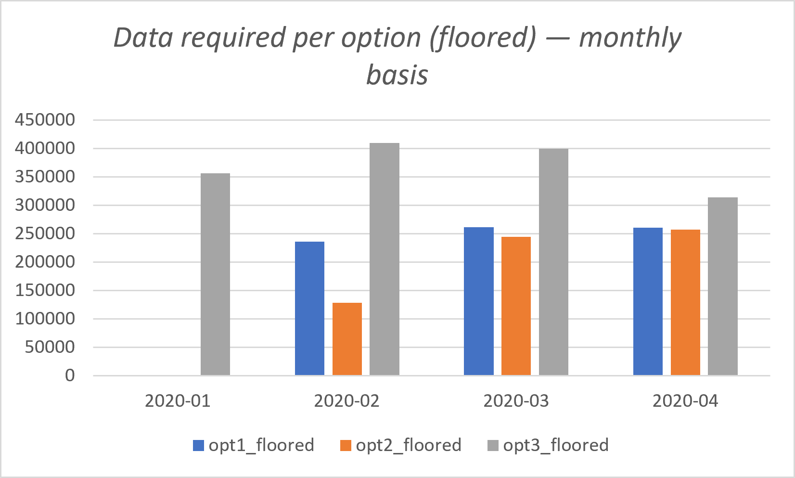

# Section C — Data Allocation Challenge

**Author:** Nguyen Thi Bao Tran  
**Last revised:** 2026-08-29  
**Source SQL:** `sql/05_analysis_c_data_allocation.sql`

## Overview
Section C giải quyết bài toán cốt lõi về hạ tầng của Data Bank: **Cần bao nhiêu dung lượng lưu trữ (data allocation) để cấp phát cho khách hàng mỗi tháng?** 
Vì mô hình kinh doanh của Data Bank gắn dung lượng server với số tiền trong tài khoản khách hàng, phần này sẽ mô phỏng 3 chiến lược cấp phát dữ liệu (Options) do đội ngũ Data Bank đề xuất, dựa trên toàn bộ dữ liệu giao dịch và số dư đã tính toán ở Section B.

---

## Executive Summary (Dành cho Business & IT Stakeholder)
1. **Nghịch lý "Dữ liệu Âm" (The Negative Data Paradox):** 74.6% khách hàng từng rớt vào trạng thái âm tiền. Nếu hệ thống cấp phát dung lượng dựa trên số dư thực tế (`raw`), IT sẽ phải "cấp phát dung lượng âm" — một điều vô lý về mặt vật lý.
2. **Quy tắc "Sàn 0" (Zero-Floor Rule) là bắt buộc:** Mọi mô hình cấp phát phải áp dụng hàm `GREATEST(balance, 0)` (coi tài khoản âm tiền có dung lượng bằng 0). Khi áp dụng sàn 0, nhu cầu lưu trữ thực tế của toàn hệ thống dao động quanh mức **260,000 đơn vị/tháng**.
3. **Đánh đổi giữa Chi phí và Trải nghiệm (UX vs Cost):** Option 1 (dựa vào tháng trước) rẻ nhất nhưng tạo ra "độ trễ" trải nghiệm (khách nạp tiền nhưng dung lượng không tăng ngay). Option 3 (Real-time) tốn kém hơn ~20-50% tài nguyên nhưng đảm bảo đúng cam kết "real-time data" của Data Bank.
4. **Rủi ro "Độ trễ của Nợ" (Debt Lag):** Các mô hình dựa vào dữ liệu quá khứ (Option 1 & 2) nhanh chóng mất giá trị dự báo vào tháng 3 và 4, khi tệp khách hàng ngày càng "thâm hụt" nặng, kéo con số dự báo rơi xuống dưới 0.

---

## C.1. Sổ cái giao dịch (Running Customer Balance)
*(Running customer balance column that includes the impact of each transaction)*

### 🎯 Business Context
Trước khi cấp phát dữ liệu theo tháng, hệ thống cần một "sổ cái" (ledger) theo dõi chính xác tác động của từng giao dịch lên tài khoản khách hàng theo thời gian thực (real-time).

### 🧠 Approach
Sử dụng hàm cửa sổ `SUM() OVER (PARTITION BY customer_id ORDER BY txn_date ROWS UNBOUNDED PRECEDING)` để cộng dồn liên tục. Giao dịch `deposit` mang dấu `+`, `purchase` và `withdrawal` mang dấu `-`.

### 💡 Insight
- Sổ cái này xác nhận lại phát hiện ở Section B: Data Bank là một **"Spending Wallet"**. Số dư (running balance) của đa số khách hàng trồi sụt rất mạnh quanh mốc 0 ngay trong nội bộ một tháng, chứ không tích lũy tĩnh.
- *Output chi tiết 5,868 dòng lưu tại `outputs/tables/c1_running_balance.csv`.*

---

## C.2. Số dư cuối tháng (Monthly Closing Balance)
*(Customer balance at the end of each month)*

### 🎯 Business Context
Đây là biến số "Stock" (lượng tồn kho) tại thời điểm chốt sổ tháng, làm đầu vào trực tiếp cho **Option 1** (cấp phát dựa trên cuối tháng trước).

### 💡 Insight
- **Tái sử dụng logic từ B.4:** Để tuân thủ nguyên tắc DRY (Don't Repeat Yourself) và đảm bảo tính nhất quán của pipeline, kết quả của C.2 chính là bảng `b4_monthly_closing_balance.csv` (2,000 dòng) đã được kiểm chứng chặt chẽ ở Section B.
- Việc tái sử dụng này đảm bảo không có bất kỳ độ lệch logic nào giữa báo cáo tài chính (Section B) và báo cáo cấp phát hạ tầng (Section C).

---

## C.3. Hồ sơ rủi ro tài chính của khách hàng (Min / Avg / Max)
*(Minimum, average and maximum values of the running balance for each customer)*

### 🎯 Business Context
Để quy hoạch hạ tầng dài hạn, Data Bank cần hiểu "vòng đời tài chính" của một khách hàng điển hình: Điểm đáy (min) họ rớt xuống là bao nhiêu? Đỉnh cao (max) họ vươn tới là bao nhiêu? Và trung bình (avg) họ sống ở mức nào?

### 📊 Result (Summary toàn hệ thống)
| Metric | Giá trị | Ý nghĩa Business |
|---|---|---|
| **Avg of Min** | **-$1,251.13** | "Điểm đáy" trung bình. Khách hàng điển hình sẽ có lúc "thấu chi" tới mức này. |
| **Avg of Avg** | **-$9.89** | Trạng thái thường trực. Khách hàng điển hình luôn sống quanh mốc **Zero** (0). |
| **Avg of Max** | **$1,238.56** | "Đỉnh cao" trung bình. Mức tài sản lớn nhất họ tạm thời nắm giữ trong kỳ. |
| **Overall Min** | -$7,953 | Khách hàng "thủng đáy" sâu nhất hệ thống. |
| **Overall Max** | $5,338 | Khách hàng giàu nhất hệ thống. |
| **Ever Negative** | **373 (74.6%)** | Gần 3/4 tệp khách hàng từng chạm ngưỡng âm tiền. |
| **Always Negative**| 4 (0.8%) | Luôn âm tiền từ giao dịch đầu tiên (có thể do lỗi phát sinh dữ liệu synthetic). |

### 💡 Insight
- **Sự thật về "Khách hàng trung bình":** Con số `Avg of Avg = -$9.89` cho thấy khách hàng của Data Bank gần như không giữ tiền. Họ nạp vào và rút ra ngay lập tức. 
- **Hệ quả cho Data Allocation:** Vì 74.6% khách hàng liên tục nhảy múa qua vạch 0, hệ thống IT sẽ phải đối mặt với hàng ngàn lần "kích hoạt / ngắt" dung lượng lưu trữ mỗi ngày nếu chọn mô hình Real-time.

---

## C.4. Bài toán cấp phát Data: 3 Options (Monthly Basis)
*(How much data would have been required for each option on a monthly basis?)*

### 🎯 Business Context
Data Bank đang cân nhắc 3 cơ chế phân bổ tài nguyên server. Vì "dung lượng âm" là vô nghĩa, báo cáo này trình bày song song hai kịch bản:
1. **Raw:** Giữ nguyên giá trị âm (để thấy độ méo của dữ liệu do bù trừ nợ).
2. **Floored:** Áp dụng quy tắc `GREATEST(balance, 0)` — **Khuyến nghị chính thức** (tài khoản nợ không được cấp dung lượng).

### 📊 Kết quả Provisioning (Đơn vị: Data Units)
| Tháng | Option 1 (Raw / **Floored**) | Option 2 (Raw / **Floored**) | Option 3 (Raw / **Floored**) |
|---|---|---|---|
| **2020-01** | N/A (Chưa có dữ liệu quá khứ) | N/A | 356,518 / **356,618** |
| **2020-02** | 126,091 / **235,595** | 96,655 / **128,433** | 331,159 / **410,126** |
| **2020-03** | -13,708 / **261,508** | 67,456 / **244,605** | 194,737 / **399,620** |
| **2020-04** | -184,592 / **260,971** | -94,313 / **257,327** | -83,857 / **314,374** |

*(Output chi tiết: `outputs/tables/c4_monthly_data_required.csv`)*
*Định nghĩa:*
- *Option 1: Allocation tháng M = Closing balance tháng M-1.*
- *Option 2: Allocation tháng M = Trung bình daily balance của 30 ngày trước tháng M.*
- *Option 3 (Real-time): Allocation = Đỉnh (max) nhu cầu trong nội bộ tháng M.*

**📌 Technical Note — Vì sao Opt3 tháng 1 có Floored (356,618)?>Raw (356,518)?**
`raw = SUM(max_bal)` vẫn cộng dồn cả "đỉnh" số dư **âm** của nhóm khách không bao giờ dương trong tháng (nhóm "Always Negative" ở C.3), còn `floored = SUM(GREATEST(max_bal, 0))` đẩy các đỉnh âm đó về 0 trước khi cộng. Khi các số hạng âm bị loại, tổng floored tất yếu cao hơn tổng raw — phần chênh **+100** chính là tổng độ sâu của các đỉnh âm bị floor về 0.

### 💡 Insight & Phân tích Chiến lược

1. **Sự sụp đổ của các mô hình "Lag" (Độ trễ):**
   Nhìn vào cột **Raw** của Option 1 và 2, con số rơi tự do xuống mức âm (-13k, -184k, -94k). Điều này xảy ra vì dân số âm balance ngày càng phình to (như đã chứng minh ở B.4). Khi tổng tài sản ròng của hệ thống âm đi, việc lấy "trung bình" hay "số dư tháng trước" sẽ trả về kết quả âm. **Mô hình Lag hoàn toàn gãy đổ khi áp dụng vào một tệp khách hàng net-spender.**

2. **Option 3 (Real-time) phản ánh đúng "nhịp đập" thực tế:**
   Dù số dư cuối tháng có âm, trong nội bộ tháng khách hàng vẫn có lúc nhận lương (deposit) và đạt "đỉnh" (peak) số dư. Option 3 bắt được các đỉnh này (Floored dao động 314k - 410k). Đây là con số thể hiện đúng **tải trọng thực tế** (actual load) mà server phải chịu đựng khi khách hàng giao dịch.

3. **Nghịch lý Tháng 4 (P-10):**
   Dữ liệu tháng 4 bị cắt cụt ở ngày 28. Tuy nhiên, ngay cả với 28 ngày, Option 3 (Floored) vẫn đòi hỏi **314,374 đơn vị** — xấp xỉ các tháng trước. Điều này chứng tỏ dung lượng không phụ thuộc vào độ dài của tháng, mà phụ thuộc vào **biên độ dao động (volatility)** của dòng tiền.

### 🎯 Recommendation cho Data Bank

- **Về mặt Kỹ thuật (Infrastructure):** Bắt buộc phải hard-code luật **Zero-Floor** (`GREATEST(balance, 0)`) vào pipeline cấp phát. IT cần chuẩn bị hạ tầng baseline khoảng **260,000 Data Units** để phục vụ các customers dương tiền.
- **Về mặt Sản phẩm (Product Strategy):** 
  - Nếu chọn **Option 1**, Data Bank sẽ tiết kiệm được chi phí server, nhưng sẽ vi phạm nghiêm trọng trải nghiệm người dùng: *Khách hàng vừa deposit $1,000 nhưng dung lượng Data Vault không được mở rộng ngay, phải chờ đến tháng sau.*
  - **Khuyến nghị chọn Option 3 (Real-time):** Dù tốn kém hơn (~400k units peak), nó khớp hoàn hảo với thông điệp *"world-leading security and real-time data platform"* mà Data Bank dùng để pitch cho investors. Hệ thống phải co giãn (scale) dung lượng theo thời gian thực ngay khi tiền vừa về tài khoản.

### 📈 Visualization

*Option 3 luôn cao nhất (314k–410k) vì phải phủ **đỉnh** nhu cầu trong tháng; Option 1/2 rẻ hơn (~260k) nhưng mang "độ trễ" trải nghiệm. Đây là trade-off chi phí vs UX được nêu trong Recommendation.*

